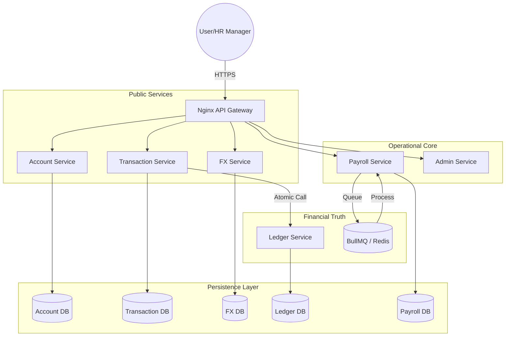

# NovaPay Transaction Backend Refinery 🛡️💎

The NovaPay Backend Refinery Is A Mission-Critical Transaction Platform Designed To Handle Bulk Payroll And International Transfers With Absolute Integrity. Built To Resynchronize A Failed System, This Architecture Implements Rigorous Idempotency, Atomic Recovery, And Time-Locked FX Quotes To Eliminate Financial Drift.

---

## 🏰 Architectural Overview
The System Follows A **Cellular Microservice Architecture** With Strict Database Isolation (No Shared Databases).



---

## 🚀 QuickStart & Setup
To Boot The Entire Refinery From Zero:

1. **Install Dependencies**: Run this in the root directory to grab all NPM packages.
   ```bash
   npm install
   ```

2. **Initialize Environment**: This script automatically sets up your local `.env` files.
   ```bash
   ./setup.sh    # Git Bash / Linux / Mac
   .\setup.ps1   # PowerShell / Windows
   ```

3. **Boot Infrastructure**: Launch Postgres, Redis, and all exactly-once microservices. *Prisma clients and database schemas will generate automatically inside the containers.*
   ```bash
   cd infra
   docker-compose up -d --build
   ```

4. **Verify The System**: Once the containers are running, execute the full mathematical hardening test suite.
   ```bash
   npm test
   ```

---

## 🛰️ API Endpoint Catalog (Mission Deliverable #2)
All Internal Traffic Flows Through The Nginx Gateway At `http://localhost:8088`.

### 🏢 1. Account Service (`/accounts`)
- **POST `/account`**
  - *Req*: `{"userId": "emp-001", "currency": "USD"}`
  - *Res*: `{"id": "acc-123", "userId": "emp-001"}`
- **GET `/:id/wallets`**
  - *Res*: `[{"id": "w-1", "currency": "USD"}]`
- **POST `/:id/wallets`**
  - *Req*: `{"currency": "BDT"}`
  - *Res*: `{"id": "w-2", "currency": "BDT"}`

### 💱 2. FX Service (`/fx`)
- **POST `/quote`**
  - *Req*: `{"fromCurrency": "USD", "toCurrency": "BDT"}`
  - *Res*: `{"id": "quote-789", "rate": "123.00", "secondsRemaining": 60}`
- **GET `/quote/:id`**
  - *Res*: `{"id": "quote-789", "rate": "123.00", "isValid": true}`
- **POST `/quote/:id/use`**
  - *Res*: `{"status": "MARKED_USED"}`

### 💸 3. Transaction Service (`/transactions`)
- **POST `/`**
  - *Req*: `{"fromWalletId": "w-1", "toWalletId": "w-2", "amount": 10, "currency": "USD", "idempotencyKey": "tx-123"}`
  - *Res*: `{"id": "tx-001", "status": "PENDING"}`
- **POST `/transfers/international`**: **Mission Problem 1 & 3 Hardening**
  - *Req*: `{"fromWalletId": "w-1", "toWalletId": "w-r", "amount": 100, "quoteId": "quote-789", "idempotencyKey": "transfer-abc"}`
  - *Res*: `{"id": "tx-002", "status": "COMPLETED"}`
- **GET `/history`**
  - *Res*: `[{"id": "tx-001", "amount": 10, "status": "PENDING"}]`
- **GET `/metrics/stats`** (Business Intelligence)
  - *Res*: `{"completedCount": 150, "totalVolume": 50000}`

### 📑 4. Payroll Service (`/payroll`)
- **POST `/`**
  - *Req*: `{"employerId": "hr-1", "fromWalletId": "w-hr", "items": [{"userId": "emp-1", "walletId": "w-e1", "amount": 50, "currency": "USD"}]}`
  - *Res*: `{"jobId": "pay-999", "status": "QUEUED"}`
- **GET `/:id`**
  - *Res*: `{"jobId": "pay-999", "processedItems": 1, "totalItems": 1}`

### 📒 5. Ledger Service (`/ledger`)
- **POST `/account`**
  - *Req*: `{"walletId": "w-1", "currency": "USD"}`
  - *Res*: `{"id": "led-acc-1"}`
- **POST `/entry`**
  - *Req*: `{"fromWalletId": "w-1", "toWalletId": "w-2", "amount": 10, "currency": "USD", "transactionId": "tx-001"}`
  - *Res*: `{"transactionId": "tx-001", "status": "BALANCED"}`
- **GET `/invariant`**
  - *Res*: `{"status": "BALANCED", "drift": "0.00"}`

### 🛡️ 6. Admin Service (`/admin`)
- **GET `/health`**
  - *Res*: `{"status": "ok", "services": {"account-service": "up"}}`
- **GET `/ledger-invariant`**
  - *Res*: `{"isBalanced": true, "totalDebit": 250, "totalCredit": 250}`
- **GET `/business-metrics`** (Board-Ready Global Dashboard)
  - *Res*: `{"completedCount": 1500, "totalCount": 1512, "totalVolume": 1000000}`

---

## 🛡️ Hardening Logic (Mission Deliverables #3-7)

### 💎 1. Five-Scenario Idempotency Matrix
- **Scenario A (Exact Match)**: Returns existing record if `key` + `hash` match.
- **Scenario B (Race Condition)**: DB-level **UNIQUE Index** block simultaneous commits.
- **Scenario C (Atomic Recovery)**: Crash worker resumes `PROCESSING` states after 30s.
- **Scenario D (Key Expiry)**: Rejects keys older than 24h.
- **Scenario E (Payload Hijacking)**: Rejects if `key` matches but `amount` differs from initial.

### ⚖️ 2. Double-Entry Invariant & Verification
Every transaction maps to a **Debit** and **Credit** pair. We verify sanity via `Sum(LedgerEntries) === 0`. The `/ledger/invariant` endpoint runs absolute aggregation to detect drift.

### 💱 3. FX Quote Strategy
- **Expiry**: 60-second TTL enforced via Redis/DB timestamp checks.
- **Single-Use**: Quotes are flagged `used` upon first transaction.
- **Provider Failure**: System pauses quoting during outage to prevent stale-rate arbitrage.

### 📑 4. Payroll Resumability (Checkpoint Pattern)
Workers use a **Stateful Job Queue**. Each creditor is tracked individually. On restart, the worker queries `PayrollItem where status != 'COMPLETED'`, skipping already paid employees.

---

## 🛠️ Tradeoffs & Roadmap (Mission Deliverables #8-9)

### Current Tradeoffs
- **Postgres Separation**: Prioritized microservice compliance over shared-database performance.
- **HTTP/1.1**: Used REST for simplicity; gRPC is better for production scale.

### Future Roadmap
- **Hardware Security (HSM)**: Secure storage for Master Keys.
- **Zero-Knowledge Proofs**: Allow external audits without exposing private salary data.

---
